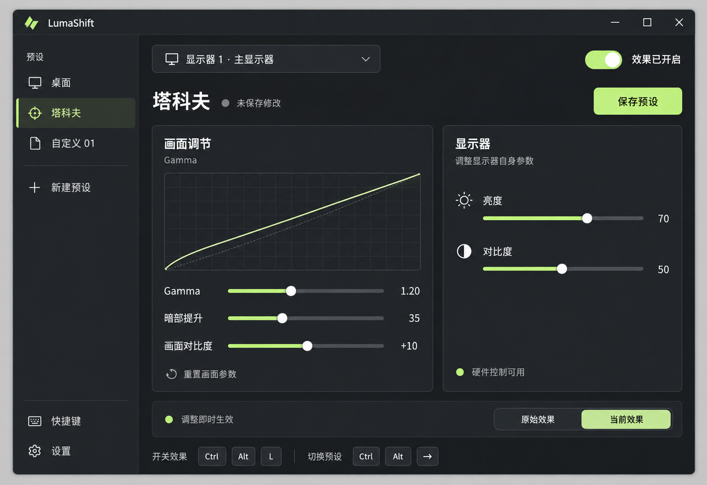

# LumaShift UI 草图 v1

日期：2026-09-26。状态：供讨论的布局草图，尚未确认或实现。

后续反馈：用户要求加入设备支持时的硬件饱和度，并采用可配置的 F 键切换预设。v1 图片保留为历史草图，最新功能范围以 [初版需求](../mvp.md) 为准。



## 设计意图

- 左侧：预设列表、新建入口、快捷键和设置。
- 顶部：目标显示器、效果总开关、当前预设和显式保存。
- 中间：Gamma 曲线与画面调节；右侧：显示器硬件亮度和对比度。
- 底部：实时生效提示、原始效果与当前效果切换、快捷键提示。
- 关闭窗口沿用初版约定：收进托盘并保持效果。

图中的 Gamma、暗部提升、画面对比度为待讨论的控制项；曲线、数值、设备状态、预设名称和快捷键均为示例，不代表已探测的硬件能力或已定案的默认设置。实际屏幕承担实时预览，草图不包含游戏截图预览区。

## 生成方式

使用内置 image_gen 工具和 imagegen skill。图片为 AI 生成的栅格视觉草图。

## 完整生成提示词

```text
Use case: ui-mockup.
Create one polished high-fidelity raster UI design draft for a compact Windows desktop application named LumaShift. This is a practical product UI review image, NOT a website, marketing poster, or dashboard. The product adjusts display Gamma and monitor hardware brightness/contrast for a player of Escape from Tarkov. Show the actual application window straight-on at large readable scale, with a thin quiet neutral background margin. Landscape image approximately 1600 x 1100. A single complete window, not multiple variants. No photographic desktop, no perspective, no hands.

Visual design: sophisticated restrained dark desktop utility, warm graphite surfaces, clear white and muted gray typography, one pale lime accent used sparingly for the active preset, slider fills and enabled switch. Fine low-contrast borders, soft 10px corner radii, meticulous spacing, crisp modern sans-serif Chinese text. High readability and logical hierarchy. Clean custom-designed product feel. No neon glow, gradients, glass, purple backgrounds, oversized headings, decorative gauges or dense nested cards.

Layout:
- Slim Windows title bar, LumaShift with a simple small light-shift geometric icon on left, normal minimize/maximize/close controls on right.
- Narrow 210px left sidebar with a quiet label "预设", three rows: "桌面", "塔科夫", "自定义 01". "塔科夫" is selected with subtle lime tint and a narrow accent marker. A "+ 新建预设" action below. At the bottom, small icon-and-label navigation "快捷键" and "设置".
- Main area with generous 28px spacing. First row: compact display selector with monitor icon reading "显示器 1 · 主显示器" and chevron on left, master on-switch with label "效果已开启" on right.
- Next row: title "塔科夫", small discreet dot and caption "未保存修改"; right-aligned primary button "保存预设".
- Main controls use two balanced columns: a wider Gamma panel on the left and a narrower monitor panel on the right. Both panels align at the top and bottom, with minimal border styling.
- Left panel title "画面调节" with small secondary label "Gamma". A small restrained curve visualization at top: fine grid, faint diagonal original line, smooth slightly raised lime tone curve, no complex chart labels. This is a curve visualization only, not a photograph or game image. Below, three clearly separated sliders, values right aligned: "Gamma" value "1.20"; "暗部提升" value "35"; "画面对比度" value "+10". Sliders have slim tracks, small round thumb, evenly spaced labels. Bottom small subtle text button "重置画面参数".
- Right panel title "显示器" and secondary description "调整显示器自身参数". Two comfortable slider rows: "亮度" value "70", "对比度" value "50". Use a simple sun icon for brightness and half-circle icon for contrast. At the bottom a small muted connection indicator "硬件控制可用". Leave breathing space; do not invent more features.
- Bottom area across main content: green small status dot and "调整即时生效" on the left; a clearly visible two-segment comparison control on right labeled "原始效果" and "当前效果", with "当前效果" selected. This switches the actual display state.
- Bottom-most subtle shortcut hint strip: "开关效果" followed by separate keyboard keycaps "Ctrl", "Alt", "L"; then "切换预设" with keycaps "Ctrl", "Alt", "→". Keep hints secondary and legible.

Critical constraints:
Use the specified Chinese labels exactly, and LumaShift exactly. No saturation control, no software color matrix controls, no HDR control, no game auto-detection, no auto-switch rules. No screenshot preview, split-screen game photograph, hero banner, game art, FPS charts, huge empty preview area, database/cloud/account/subscription features. The screen itself is the live preview. Only the listed modest number of controls. Settings are illustrative draft values, not promises about actual attached hardware. The image should feel ready for a discussion of layout and control hierarchy, with excellent typography, sane density and visible full window edges.
```
