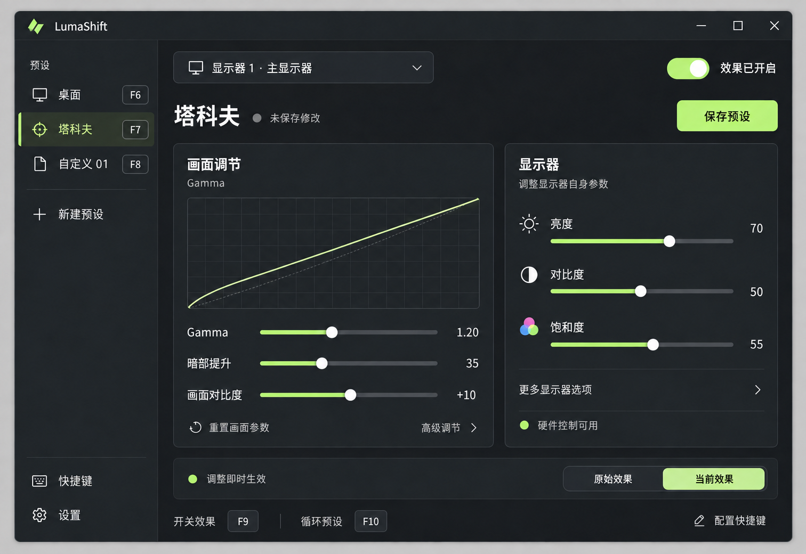

# LumaShift UI 草图 v2

日期：2026-09-26。状态：根据用户反馈修改，供继续讨论，尚未实现。



## 相对 v1 的变更

- 显示器区增加“饱和度”和“更多显示器选项”。硬件饱和度只对实际支持该控制的设备可用；本图演示支持时的布局，不代表已检测当前硬件。
- Gamma 区增加折叠的“高级调节”入口。底层是 RGB 各 256 项的曲线映射，界面滑块是应用提供的参数化方式，不受 v1 三个滑块限制；高级参数具体范围仍待确定。
- 预设旁加入可编辑的 F 键标记；底部显示开关效果、循环预设的 F 键及配置入口。
- 图中 F6/F7/F8/F9/F10 仅为示例，用户可以修改或清除绑定，也可使用组合键。注册冲突需反馈，F12 按 Windows 接口限制排除。
- 保留原始效果对比、实时生效状态、显式保存及关闭到托盘的交互约定。

## 生成方式

使用内置 image_gen 工具编辑 [v1 草图](ui-draft-v1.png)，保留 v1 原图。完整需求见 [mvp.md](../mvp.md)。

## 完整编辑提示词

```text
Use case: ui-mockup edit.
Edit the provided LumaShift Windows desktop UI draft into version 2. The provided image is the edit target. Preserve its overall layout, window dimensions, dark graphite palette, pale lime accents, typography, left preset sidebar, two main control panels, Gamma curve, display selector, master switch, save button, and original/current comparison. Maintain the same crisp straight-on desktop app mockup. Change only the controls and labels requested below, with small spacing adjustments necessary to fit them cleanly.

1. In the left preset sidebar, add small dark outlined keyboard keycap badges aligned at the right of the three preset rows:
"桌面" badge "F6"
"塔科夫" badge "F7"
"自定义 01" badge "F8"
Keep "塔科夫" selected. The badges should look clickable/configurable, like compact shortcut fields. Give row text enough room. Do not add F12 or Ctrl key combinations.

2. In the right "显示器" panel retain the brightness slider "亮度" value "70" and contrast slider "对比度" value "50". Add a third equally styled slider below them:
label "饱和度", value "55", small tasteful three-circle color icon.
This shows the intended layout on a monitor that supports hardware saturation. Below the third slider add a subtle text disclosure row "更多显示器选项" with a right chevron. Retain the muted bottom connection indicator "硬件控制可用". Adjust vertical spacing to remain balanced and readable. Do not add a fake screenshot preview or more sliders.

3. In the left "画面调节" panel keep the Gamma graph and all three existing sliders exactly as in the original. At the bottom, arrange the existing "重置画面参数" action at the left and a subtle disclosure control "高级调节" with a right chevron at the right. This indicates additional curve controls can be revealed; do not expand them yet.

4. Replace the old bottom Ctrl/Alt shortcut hint strip with a simpler row:
"开关效果" followed by a single "F9" keycap;
"循环预设" followed by a single "F10" keycap;
right-aligned subtle clickable text "配置快捷键" with a small edit icon.
These F key assignments are illustrative and editable. Remove all old Ctrl/Alt/L/arrow keycaps.

5. Keep all other existing Chinese text exact and legible, including "调整即时生效", "原始效果", "当前效果", "保存预设", "未保存修改", "效果已开启", "显示器 1 · 主显示器", "快捷键", "设置" and "LumaShift".
No added marketing text, banners, watermarks or design annotations. No change to the core screen composition. Preserve visual quality and spacing.
```
